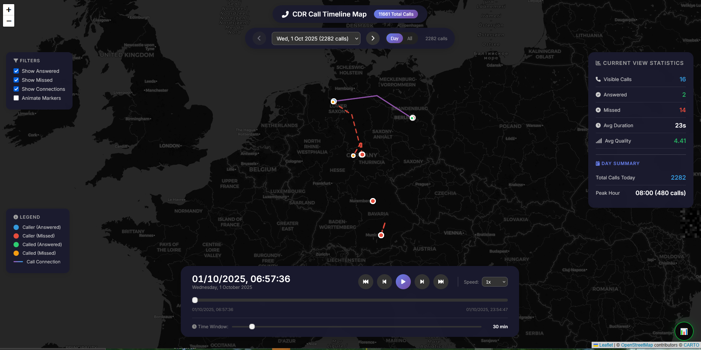

# Cisco CDR Analyzer

Analyse-Tool fuer Cisco Unified Communications Manager Call Detail Records (CDR) und Call Management Records (CMR).



---

## Inhaltsverzeichnis

- [Funktionen](#funktionen)
- [Installation](#installation)
- [Verwendung](#verwendung)
  - [Kommandozeile](#kommandozeile)
  - [CSV-Import](#csv-import)
  - [Python API](#python-api)
- [Projektstruktur](#projektstruktur)
- [Analyse-Module](#analyse-module)
- [Visualisierungen](#visualisierungen)
- [Konfiguration](#konfiguration)
- [Beispiele](#beispiele)

---

## Funktionen

| Kategorie | Beschreibung |
|-----------|--------------|
| Zeit-Analyse | Taegliche, woechentliche, monatliche Trends, Peak-Hours, Business-Hours-Auswertung |
| Benutzer-Analyse | Top-Anrufer, Anrufmuster, Abteilungsstatistiken, inaktive Benutzer |
| Geraete-Analyse | Geraetenutzung, Trunk-Auslastung, Registrierungsstatus, Health-Monitoring |
| Qualitaets-Analyse | MOS-Scores, Jitter, Latenz, Paketverlust, Codec-Statistiken, SLA-Compliance |
| Hunt-Group-Analyse | Warteschlangen, Wartezeiten, Abbruchraten, Service-Level |
| Sicherheits-Analyse | Toll-Fraud-Erkennung, After-Hours-Anomalien, Compliance-Pruefung |

---

## Installation

```bash
# Repository klonen
git clone https://github.com/hleguern/CISCO_CDR_ANLAYZER.git cisco_cdr_analyzer
# Befehle aus dem uebergeordneten Ordner ausfuehren (Paketname: cisco_cdr_analyzer)

# Abhaengigkeiten installieren
pip install -r cisco_cdr_analyzer/requirements.txt

# Optional: Interaktive Visualisierungen
pip install plotly

# Optional: Excel-Export
pip install openpyxl
```

---

## Verwendung

### Kommandozeile

```bash
# Basis-Analyse mit CDR-Datei
python -m cisco_cdr_analyzer --cdr data/cdr.csv --summary

# Mit CMR-Daten fuer Qualitaetsanalyse
python -m cisco_cdr_analyzer --cdr data/cdr.csv --cmr data/cmr.csv --quality

# HTML-Report generieren
python -m cisco_cdr_analyzer --cdr data/cdr.csv --report --output reports/

# Benutzer-spezifische Analyse
python -m cisco_cdr_analyzer --cdr data/cdr.csv --user 1234 --days 30

# Geraete-Analyse
python -m cisco_cdr_analyzer --cdr data/cdr.csv --device SEP001122334455

# Charts generieren
python -m cisco_cdr_analyzer --cdr data/cdr.csv --charts --interactive

# Sicherheitsanalyse
python -m cisco_cdr_analyzer --cdr data/cdr.csv --security
```

### Kommandozeilen-Optionen

| Option | Beschreibung |
|--------|--------------|
| `--cdr, -c` | Pfad zur CDR-Datei (erforderlich, ausser bei Analyse aus dem Store) |
| `--cmr, -m` | Pfad zur CMR-Datei (optional) |
| `--import, -i` | CSV-Datei, Verzeichnis oder Glob in den Store importieren (mehrfach moeglich) |
| `--db` | Pfad zum SQLite-Store (Standard: data/cdr_store.db) |
| `--import-only` | Nur importieren, keine Analyse |
| `--force-import` | Bereits importierte Dateien erneut einlesen (Duplikate werden trotzdem ignoriert) |
| `--store-days` | Bei Analyse aus dem Store nur die letzten N Tage verwenden |
| `--store-stats` | Store-Statistik und Import-Historie anzeigen |
| `--output, -o` | Ausgabeverzeichnis (Standard: output) |
| `--report, -r` | HTML-Report generieren |
| `--report-format` | Report-Format: html, json, xlsx |
| `--summary, -s` | Zusammenfassung in Konsole ausgeben |
| `--user, -u` | Benutzer/Nebenstelle analysieren |
| `--device, -d` | Geraet analysieren |
| `--days` | Anzahl Tage fuer Analyse (Standard: 30) |
| `--quality, -q` | Qualitaetsanalyse einschliessen |
| `--security` | Sicherheitsanalyse einschliessen |
| `--charts` | Chart-Bilder generieren |
| `--interactive` | Interaktive HTML-Charts generieren |
| `--verbose, -v` | Ausfuehrliche Ausgabe |
| `--debug` | Debug-Modus |

### CSV-Import

CDR/CMR-Exporte aus dem CUCM koennen in einen lokalen SQLite-Store importiert werden.
Die Daten sammeln sich ueber mehrere Importe an und koennen danach ohne erneutes Einlesen
der Dateien analysiert werden.

- Datensatztyp (CDR oder CMR) wird anhand der Kopfzeile erkannt
- Die CUCM-Typzeile (`INTEGER,VARCHAR(50),...`) wird automatisch uebersprungen
- Trennzeichen (`,` `;` Tab `|`) und Kodierung (UTF-8, CP1252, Latin-1) werden erkannt
- Duplikate werden ueber `pkid` erkannt; bereits importierte Dateien werden uebersprungen
- Neue Spalten (unterschiedliche CUCM-Versionen) werden automatisch ergaenzt

```bash
# Ganzes Verzeichnis importieren (CDR und CMR gemischt)
python -m cisco_cdr_analyzer --import exports/ --import-only

# Mehrere Quellen importieren und direkt analysieren
python -m cisco_cdr_analyzer --import "exports/cdr_*" --import "exports/cmr_*" --summary

# Analyse aus dem Store (letzte 30 Tage)
python -m cisco_cdr_analyzer --db data/cdr_store.db --report --store-days 30

# Store-Statistik und Import-Historie
python -m cisco_cdr_analyzer --store-stats
```

```python
from cisco_cdr_analyzer import CiscoCDRAnalyzer, CSVImporter

importer = CSVImporter('data/cdr_store.db')
for result in importer.import_path('exports/'):
    print(result)          # cdr_2024.csv: CDR - 1200 read, 1180 new, 20 duplicates

analyzer = CiscoCDRAnalyzer()
analyzer.load_from_store('data/cdr_store.db', days=30)
analyzer.merge_data()
```

### Python API

```python
from cisco_cdr_analyzer import CiscoCDRAnalyzer
from cisco_cdr_analyzer.config.settings import Settings

# Analyzer initialisieren
settings = Settings()
settings.business_hours.start_hour = 8
settings.business_hours.end_hour = 18

analyzer = CiscoCDRAnalyzer(settings)

# Daten laden
analyzer.load_cdr('data/cdr.csv')
analyzer.load_cmr('data/cmr.csv')
analyzer.merge_data()

# Zusammenfassung abrufen
summary = analyzer.get_call_summary()
print(f"Gesamtanrufe: {summary['total_calls']}")
print(f"Annahmerate: {summary['answer_rate_pct']}%")

# Zeit-Analyse
daily = analyzer.time.get_daily_call_volume()
peak_hours = analyzer.time.get_peak_hours(top_n=5)
weekly = analyzer.time.get_weekly_trends(weeks=8)

# Benutzer-Analyse
top_callers = analyzer.users.get_top_callers(10)
user_stats = analyzer.users.get_user_statistics('1234')
activity = analyzer.users.get_user_activity_pattern('1234')

# Geraete-Analyse
device_summary = analyzer.devices.get_device_summary()
trunk_util = analyzer.devices.get_trunk_utilization()

# Qualitaets-Analyse
quality = analyzer.get_quality_summary()
mos_dist = analyzer.quality.get_mos_distribution()
issues = analyzer.quality.get_quality_issues()

# Hunt-Group-Analyse
hunt_groups = analyzer.hunt_groups.get_all_hunt_groups()
hg_stats = analyzer.hunt_groups.get_hunt_group_stats('HG001')
wait_times = analyzer.hunt_groups.get_queue_wait_times('HG001')

# Sicherheits-Analyse
fraud = analyzer.security.detect_toll_fraud()
security_summary = analyzer.security.get_security_summary()
```

---

## Projektstruktur

```
cisco_cdr_analyzer/
├── main.py                    # Haupt-Einstiegspunkt
├── run_analyzer.py            # Analyzer-Runner
├── example_usage.py           # Ausfuehrliche Beispiele
├── analysis/
│   ├── base.py                # Basis-Analyseklasse
│   ├── time_analysis.py       # Zeitbasierte Analyse
│   ├── user_analysis.py       # Benutzer-Analyse
│   ├── device_analysis.py     # Geraete-Analyse
│   ├── quality_analysis.py    # Qualitaets-Analyse
│   ├── hunt_group_analysis.py # Hunt-Group-Analyse
│   └── security_analysis.py   # Sicherheits-Analyse
├── config/
│   └── settings.py            # Konfigurationseinstellungen
├── core/
│   ├── analyzer.py            # Haupt-Analyzer-Klasse
│   ├── data_loader.py         # Daten-Import
│   ├── csv_importer.py        # CSV-Import in SQLite-Store
│   └── data_processor.py      # Datenverarbeitung
├── tests/
│   └── test_csv_importer.py   # Tests fuer den CSV-Import
├── utils/
│   ├── helpers.py             # Hilfsfunktionen
│   └── validators.py          # Validierungsfunktionen
├── visualization/
│   ├── base_viz.py            # Basis-Visualisierung
│   ├── charts.py              # Statische Charts
│   ├── heatmaps.py            # Heatmap-Visualisierungen
│   ├── interactive.py         # Interaktive Plotly-Charts
│   ├── map_visualization.py   # Karten-Visualisierung
│   └── reports.py             # Report-Generierung
└── data/
    ├── cdr.csv                # CDR-Beispieldaten
    └── cmr.csv                # CMR-Beispieldaten
```

---

## Analyse-Module

### Zeit-Analyse

```python
# Taegliches Anrufvolumen
daily = analyzer.time.get_daily_call_volume()

# Woechentliche Trends mit Veraenderung
weekly = analyzer.time.get_weekly_trends(weeks=8)

# Peak-Stunden identifizieren
peak_hours = analyzer.time.get_peak_hours(top_n=5)

# Business Hours vs After Hours
bh_stats = analyzer.time.get_business_hours_stats()

# Heatmap-Daten (Stunde x Wochentag)
heatmap = analyzer.time.get_hourly_heatmap_data()

# Gleichzeitige Anrufe
concurrent = analyzer.time.get_peak_concurrent_calls()

# Zeitraum-Vergleich
comparison = analyzer.time.compare_periods(
    period1_start, period1_end,
    period2_start, period2_end
)
```

### Benutzer-Analyse

```python
# Top-Anrufer und angerufene Nummern
top_callers = analyzer.users.get_top_callers(10)
top_called = analyzer.users.get_top_called(10)

# Detaillierte Benutzerstatistiken
stats = analyzer.users.get_user_statistics('1234')

# Aktivitaetsmuster
activity = analyzer.users.get_user_activity_pattern('1234')

# Anrufhistorie
history = analyzer.users.get_user_call_history('1234', days=30)

# Enge Kontakte
contacts = analyzer.users.get_close_contacts('1234', top_n=10)

# Abteilungsstatistiken
dept_mapping = {'Sales': ['1001', '1002'], 'Support': ['2001', '2002']}
dept_stats = analyzer.users.get_department_stats(dept_mapping)

# Verpasste Anrufe
missed = analyzer.users.get_missed_call_analysis()
```

### Geraete-Analyse

```python
# Geraete-Uebersicht
summary = analyzer.devices.get_device_summary()

# Geraete nach Typ
by_type = analyzer.devices.get_devices_by_type()

# Geraetestatistiken
stats = analyzer.devices.get_device_statistics('SEP001122334455')

# Geraetenutzung ueber Zeit
utilization = analyzer.devices.get_device_utilization('SEP001122334455')

# Trunk-Auslastung
trunk_util = analyzer.devices.get_trunk_utilization()

# Geraete-Gesundheitsstatus
health = analyzer.devices.get_device_health_status()

# Qualitaetsvergleich mehrerer Geraete
comparison = analyzer.devices.compare_device_quality(['SEP001', 'SEP002'])
```

### Qualitaets-Analyse

```python
# Qualitaetszusammenfassung
quality = analyzer.get_quality_summary()

# MOS-Verteilung
mos = analyzer.quality.get_mos_distribution()

# Qualitaetstrend
trend = analyzer.quality.get_quality_trend_over_time(period='daily')

# Qualitaet nach Codec
by_codec = analyzer.quality.get_quality_by_codec()

# Paketverlust-Analyse
packet_loss = analyzer.quality.get_packet_loss_analysis()

# Jitter-Analyse
jitter = analyzer.quality.get_jitter_analysis()

# SLA-Compliance
sla = analyzer.quality.get_quality_sla_compliance()

# Netzwerkprobleme identifizieren
issues = analyzer.quality.identify_network_issues()
```

### Hunt-Group-Analyse

```python
# Hunt-Groups auflisten
hunt_groups = analyzer.hunt_groups.get_all_hunt_groups()

# Hunt-Group-Statistiken
stats = analyzer.hunt_groups.get_hunt_group_stats('HG001')

# Mitglieder-Performance
members = analyzer.hunt_groups.get_hunt_group_member_stats('HG001')

# Wartezeiten
wait_times = analyzer.hunt_groups.get_queue_wait_times('HG001')

# Abgebrochene Anrufe
abandoned = analyzer.hunt_groups.get_abandoned_calls_analysis('HG001')

# Service-Level-Trend
sl_trend = analyzer.hunt_groups.get_service_level_trend('HG001', threshold_seconds=20)

# KPIs
kpis = analyzer.hunt_groups.get_hunt_group_kpis('HG001')
```

### Sicherheits-Analyse

```python
# Toll-Fraud-Erkennung
fraud = analyzer.security.detect_toll_fraud()

# After-Hours-Anomalien
after_hours = analyzer.security.detect_after_hours_anomalies()

# Unautorisierte Nebenstellen
unauthorized = analyzer.security.get_unauthorized_extensions(
    authorized_extensions=['1001', '1002', '1003']
)

# Hochfrequenz-Anrufer
high_freq = analyzer.security.get_high_frequency_callers()

# Compliance-Report
compliance = analyzer.security.get_compliance_report(rules={
    'max_call_duration_sec': 7200,
    'blocked_prefixes': ['900', '976']
})

# Benutzer-Audit
audit = analyzer.security.audit_user_activity('1234', days=30)

# Sicherheitszusammenfassung
summary = analyzer.security.get_security_summary()
```

---

## Visualisierungen

### Statische Charts

```python
from cisco_cdr_analyzer.visualization.charts import ChartGenerator

chart_gen = ChartGenerator(analyzer)

# Anrufe nach Stunde
fig = chart_gen.plot_calls_by_hour()
fig.savefig('calls_by_hour.png')

# Taeglicher Trend
fig = chart_gen.plot_daily_trend(days=30)

# Top-Anrufer
fig = chart_gen.plot_top_callers(n=15)

# Qualitaetsmetriken
fig = chart_gen.plot_quality_metrics()

# Trunk-Auslastung
fig = chart_gen.plot_trunk_utilization()
```

### Heatmaps

```python
from cisco_cdr_analyzer.visualization.heatmaps import HeatmapGenerator

heatmap_gen = HeatmapGenerator(analyzer)

# Stuendliche Heatmap
fig = heatmap_gen.plot_hourly_heatmap(metric='count')

# Qualitaets-Heatmap
fig = heatmap_gen.plot_quality_heatmap(metric='mos')

# Verbindungs-Heatmap
fig = heatmap_gen.plot_connection_heatmap(max_users=15)
```

### Interaktive Charts

```python
from cisco_cdr_analyzer.visualization.interactive import InteractiveVisualizer

interactive = InteractiveVisualizer(analyzer)

# Interaktiver Trend
fig = interactive.plot_daily_trend_interactive(days=60)
fig.write_html('daily_trend.html')

# Sankey-Diagramm Anruffluss
fig = interactive.plot_call_flow_sankey()

# Netzwerk-Topologie
fig = interactive.plot_network_topology()

# KPI-Gauges
fig = interactive.plot_kpi_gauges()
```

### Report-Generierung

```python
from cisco_cdr_analyzer.visualization.reports import ReportGenerator

report_gen = ReportGenerator(analyzer)

# HTML-Report
path = report_gen.generate_report(
    output_dir='reports/',
    title='CDR Analyse Report',
    include_charts=True,
    include_quality=True,
    include_security=True,
    format='html'
)

# JSON-Export
path = report_gen.generate_report(format='json')

# Excel-Export
path = report_gen.generate_report(format='xlsx')

# Rohdaten exportieren
exported = report_gen.export_raw_data(output_dir='data_export/', format='csv')
```

---

## Konfiguration

```python
from cisco_cdr_analyzer.config.settings import Settings, QualityThresholds, BusinessHours

settings = Settings()

# Business Hours
settings.business_hours.start_hour = 8
settings.business_hours.end_hour = 18
settings.business_hours.business_days = [0, 1, 2, 3, 4]  # Mo-Fr

# Qualitaetsschwellenwerte
settings.quality.jitter_warning = 30      # ms
settings.quality.jitter_critical = 50     # ms
settings.quality.latency_warning = 150    # ms
settings.quality.latency_critical = 300   # ms
settings.quality.packet_loss_warning = 1.0    # %
settings.quality.packet_loss_critical = 3.0   # %
settings.quality.mos_good = 4.0
settings.quality.mos_acceptable = 3.5

# Ausgabeverzeichnis
settings.output_dir = 'output/'

analyzer = CiscoCDRAnalyzer(settings)
```

---

## Beispiele

Ausfuehrliche Beispiele fuer alle Analysefunktionen finden sich in `example_usage.py`:

```bash
python example_usage.py
```

Das Beispielskript demonstriert:
- Datenimport und -verarbeitung
- Alle Zeit-Analysen
- Benutzer- und Geraeteanalysen
- Qualitaetsmetriken und SLA-Compliance
- Hunt-Group-Auswertungen
- Sicherheits- und Fraud-Erkennung
- Chart- und Report-Generierung
- Erweiterte Szenarien wie Kapazitaetsplanung und Anomalieerkennung

---

## Abhaengigkeiten

| Paket | Verwendung |
|-------|------------|
| pandas | Datenverarbeitung |
| numpy | Numerische Berechnungen |
| matplotlib | Statische Charts |
| plotly | Interaktive Visualisierungen (optional) |
| openpyxl | Excel-Export (optional) |

---

**Autor:** 3sp3r4nt0